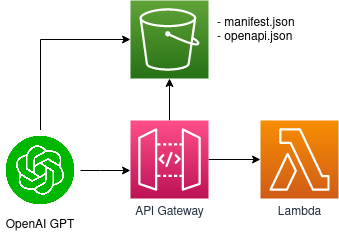

# chatgpt-plugin-scaffold

Una plataforma y template para acelerar la implementación de plugins para chatgpt en AWS usando Lambda como backend, siguiendo la especificación oficial de [OpenAI](https://platform.openai.com/docs/plugins/introduction))

## Resumen de funcionamiento
Los plugins de ChatGPT requieren una serie de componentes y descripciones para poder conectarse y ser utilizados correctamente por el modelo. Una vez que el plugin está activo su funcionamiento se resume en:

- Incorporar la descripción del plugin en el contexto de las conversaciones con el modelo. Esto permite que ChatGPT utilice el plugin cuando entienda que es relevante.
- Invocar la operación correcta de nuestro plugin: a partir de la descripción de  las operaciones, ChatGPT aprende a utilizar cada endpoint de nuestra API para enviar los parámetros correctos y para recibir y utilizar la respuesta automáticamente.
- Convertir la respuesta de nustro endpoint en el formato necesario para darle una respuesta coherente al usuario final.

## Componentes y arquitectura
Para implementar un plugin para ChatGPT usando AWS necesitarás configurar varios servicios, entre ellos S3, API Gateway y Lambda:

En este repositorio incluyo una serie de archivos Terraform para implementar y configurar estos componentes para que puedas desarrollar un plugin implementado con funciones Lambda en poco tiempo. Puedes clonar este repositorio, agregar el código de tu lambda y tener funcionando todo lo necesario para implementar un plugin en poco tiempo.

## Prerequisitos
Para desplegar este código requerirás:

- Una cuenta de OpenAI con acceso a los plugins. Puedes unirte a la lista de espera [aqui](https://openai.com/waitlist/plugins)
- Una cuenta de AWS. Puedes obtener una de manera gratuita por 12 meses [aqui](https://aws.amazon.com/es/free/start-your-free-trial/)
- Configurar el AWS CLI y obtener credenciales para un usuario de AWS para poder utilizar la linea de comandos, econtrarás como hacer esto [aquí](https://www.youtube.com/watch?v=_zMCdUndHy0)
- Descargar e instalar [Terraform](https://www.terraform.io/)

## Archivos del repositorio
Este código ha sido escrito para ayudarte a enfocarte en escribir el plugin y evitar lidiar con la infraestructura. Provee valores por default sensibles en todos lados y solo hace obligatorio introducir un parámetro cuando es estrictamente necesario.

Los cambios se limitan al archivo terraform.tfvars y en el código de tu función lambda propiamente dicho.

### manifest.json
El archivo manifest.json contiene información básica sobre tu plugin, incluyendo su nombre, versión y descripción. La descripción en este archivo será lo que GPT utilice para decidir cuando usar nuestro plugin. En este caso, el plugin se llama "SumarPlugin" y su propósito es sumar dos números.

### openapi.json
El archivo openapi.json define la especificación de la API que utiliza tu plugin. En este caso, hemos creado una API simple llamada "Sumar API" con un solo endpoint, "/sumar". Este endpoint acepta una solicitud POST con dos números en formato JSON y devuelve la suma de los dos números como respuesta. La especificación OpenAPI permite describir en detalle los parámetros de entrada y las respuestas esperadas de la API. Las descripciones de cada endpoint será lo que GPT use para saber cuando invocar cada endpoint y como enviarle parámetros.

### main.tf
Para este ejemplo implementaremos todo el código en un solo archivo. Si eres un usuario avanzado de terraform sabrás como separarlo en diferentes archivos, para hacer esto mas accesible vamos a hacer todo en un solo archivo con código de infraestructura y proveeremos nuestras variables en un archivo separado:

### terraform.tfvars
Contiene los valores de las variables que se utilizan en tu configuración de tu plugin:
- bucket_name: El nombre del bucket de Amazon S3 donde se almacenarán los archivos manifest.json y openapi.json. En este ejemplo, el nombre del bucket es "nombre-del-bucket".
- path_to_manifest: La ruta local al archivo manifest.json en tu máquina. En este ejemplo, la ruta es "ruta/al/manifest.json".
- path_to_openapi: La ruta local al archivo openapi.json en tu máquina. En este ejemplo, la ruta es "ruta/al/openapi.json".
- path_to_lambda: La ruta local al archivo comprimido lambda.zip que contiene el código fuente de la función Lambda. En este ejemplo, la ruta es "ruta/al/lambda.zip".
- lambda_runtime: El entorno de ejecución de la función Lambda en AWS. En este ejemplo, se utiliza "runtime-de-lambda" como valor, pero normalmente se especificaría un entorno de ejecución soportado por AWS Lambda, como "nodejs14.x".
- lambda_handler: El manejador de la función Lambda, que indica el archivo y la función a ejecutar cuando se invoca la función Lambda. En este ejemplo, se utiliza "manejador-de-lambda" como valor, pero normalmente se proporcionaría un manejador específico, como "index.handler".